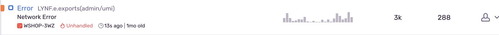
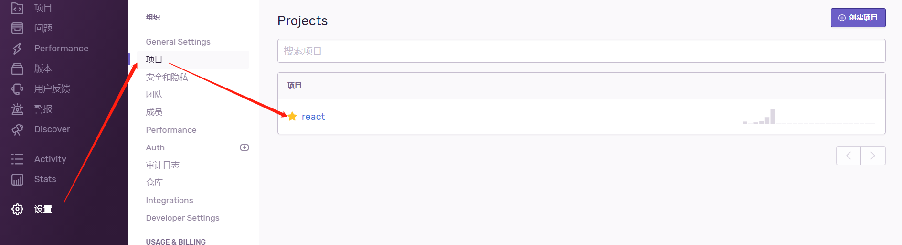
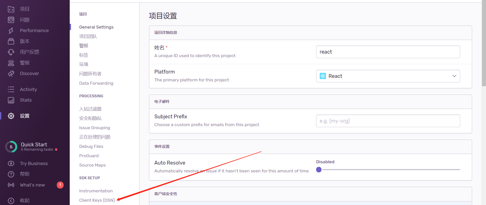

### 修复 Network Error 报错

#### 背景



- 环境：生产环境
- @sentry/browser: "^5.14.2",
  如图，临时收到修复这类问题的任务

于是开始尝试复现

#### 步骤

1. 首先，项目下问题太多了，于是自行在 sentry.io 下新建了一个 test 的项目，用于模拟
   注意点：当新建项目时，DSN 很好找，后面如果再想找的话，步骤如下
   设置--项目--点击对应项目进入--再点击 Client Key
   
   
   然后将 DSN 添加到你的代码里 `app.js`

2. 基本可以判断此类问题是因为网络延迟或者别的原因导致的，于是尝试在弱网络环境下频繁请求接口，后发现此类问题的触发是由于 chrome 发送请求出现：Provisional headers are shown 提示，例如 1. 请求被墙了，2. 服务器出错或者超时，没有真正的返回。client 发送请求后，由于各种原因，比如网络延迟，server 端逻辑错误，导致 client 端长时间未收到响应
   此类问题不应该上传 sentry

#### 解决方案

1. 此类问题不必上传 sentry, 于是修改 sentry.init 配置如下：

```js
import React from "react"
import * as Sentry from "@sentry/browser"
import SentryBoundary from "@/components/SentryBoundary"

if (ENV === "production") {
  Sentry.init({
    dsn: SENTRY_DSN, // 复制的 DSN
    beforeSend(event, hint) {
      const { response } = hint.originalException
      const {
        originalException: { message },
      } = hint
      /* net::ERR_CONNECTION_TIMED_OUT 没有返回或者请求被阻塞，不上传 sentry */
      if (!response && message === "Network Error") {
        return null
      }
      if (response) {
        const { status } = response
        if (status && status === 404) {
          return null
        }
      }
      return event
    },
  })
}

export function rootContainer(container) {
  return React.createElement(SentryBoundary, null, container)
}
```

2. 此外，还可以通过 ignoreErrors 属性来屏蔽

```js
Sentry.init({
  dsn: SENTRY_DSN,
  release: VERSION,
  ignoreErrors: [
    "Network Error",
    "ChunkLoadError",
    "timeout of 0ms exceeded",
    /Loading CSS chunk \d{1,} failed./,
  ],
  beforeSend(event, hint) {
    // originalException null
    const status = hint?.originalException?.response?.status
    if (status === 404) {
      return null
    }
    return event
  },
})
```
