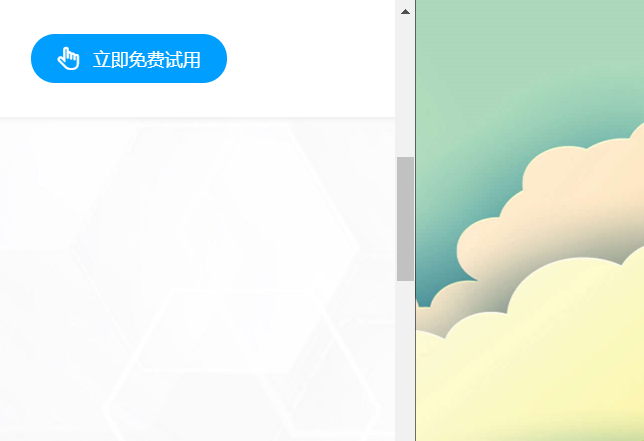
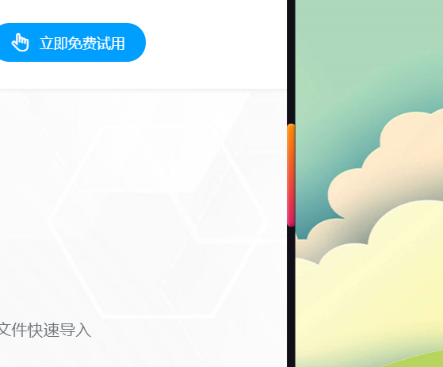

#### css 自定义滚动条的外观

##### 背景

默认的 window 外观和 mac 外观不满足需求


##### 解决方案

使用`-webkit-scrollbar` 来自定义滚动条的外观。该属性提供了七个伪元素：

- `::-webkit-scrollbar`：整个滚动条
- `::-webkit-scrollbar-button`：滚动条上的按钮（下下箭头）
- `::-webkit-scrollbar-thumb`：滚动条上的滚动滑块
- `::-webkit-scrollbar-track`：滚动条轨道
- `::-webkit-scrollbar-track-piece`：滚动条没有滑块的轨道部分
- `::-webkit-scrollbar-corner`：当同时有垂直和水平滚动条时交汇的部分
- `::-webkit-resizer`：类似 textarea 的可拖动按钮

示例如下

```
html {
  scrollbar-color: linear-gradient(to bottom,#ff8a00,#da1b60);
  scrollbar-width: 10px;
  background: #100e17;
  color: #fff;
  overflow-x: hidden
}
html::-webkit-scrollbar {
  width: 10px;
  height: 10px
}
html::-webkit-scrollbar-thumb {
  background: -webkit-gradient(linear,left top,left bottom,from(#ff8a00),to(#da1b60));
  background: linear-gradient(to bottom,#ff8a00,#da1b60);
  border-radius: 10px;
  -webkit-box-shadow: inset 2px 2px 2px rgba(255,255,255,.25),inset -2px -2px 2px rgba(0,0,0,.25);
  box-shadow: inset 2px 2px 2px rgba(255,255,255,.25),inset -2px -2px 2px rgba(0,0,0,.25)
}

html::-webkit-scrollbar-track {
  background: linear-gradient(to right,#201c29,#201c29 1px,#100e17 1px,#100e17)
}

```

效果如下：
